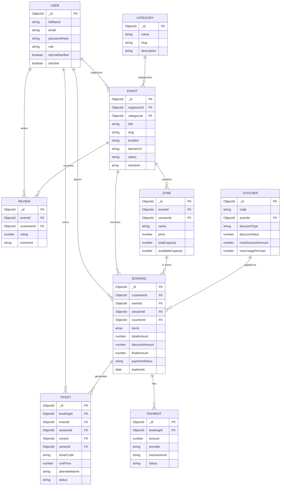

# Đặc tả Cơ sở dữ liệu

Hệ thống Đặt vé Sự kiện (Ticketbox Clone) — **Node.js · MongoDB · Mongoose**

Tài liệu này mô tả cấu trúc dữ liệu (schema) chuẩn của hệ thống, đã được tối ưu hóa sau review kiến trúc và hoàn thiện các điểm nghiệp vụ thực tế.

## Mục lục

- [Tổng quan](#tổng-quan)
- [Nguyên tắc thiết kế](#nguyên-tắc-thiết-kế)
- [Sơ đồ ERD](#sơ-đồ-erd)
- [Chi tiết Collection](#chi-tiết-collection)
  - [User](#user)
  - [Category](#category)
  - [Event](#event)
  - [Zone](#zone)
  - [Voucher](#voucher)
  - [Booking](#booking)
  - [Ticket](#ticket)
  - [Payment](#payment)
  - [Review](#review)

## Tổng quan

Database gồm **9 collection** (kèm thực thể nhúng **Session** trong Event), xoay quanh luồng nghiệp vụ cốt lõi:

```
User tạo Event (mặc định PENDING chờ Admin duyệt)
  → Event có 1 hoặc nhiều Session (Suất diễn theo ngày/giờ)
    → Mỗi Session có các Zone (Hạng vé: VIP, Standard...)
      → Khách đặt Booking (giữ chỗ tạm 10 phút, kiểm tra kho vé atomic)
        → Khách áp dụng Voucher (nếu có)
          → Payment xử lý và lưu lịch sử giao dịch
            → Ticket điện tử (mã QR độc lập từng vé) được phát hành
              → Staff quét vé tại cổng check-in
                → Khách viết Review sau khi sự kiện kết thúc
```

## Nguyên tắc thiết kế

| Nguyên tắc | Giải thích |
|---|---|
| **Chống bán vượt vé (overselling)** | `Zone.availableCapacity` luôn cập nhật bằng thao tác atomic (`findOneAndUpdate` với điều kiện `$gte`), không đọc rồi ghi. |
| **Giữ chỗ tạm thời (reservation hold)** | `Booking` ở trạng thái `PENDING` có `expiresAt` (mặc định 10 phút). Khi quá hạn, cron job/worker chuyển sang `EXPIRED` và hoàn trả `availableCapacity` về `Zone`. **Không dùng TTL Index để xóa document** nhằm giữ vết kế toán và đối soát thanh toán muộn. |
| **Hỗ trợ đa suất diễn (multi-session)** | Mỗi `Event` có thể có nhiều `Session`. Mỗi `Zone` thuộc về một `Session` cụ thể để quản lý sức chứa và bán vé riêng biệt cho từng buổi diễn. |
| **Chốt giá tại thời điểm mua (snapshot pricing)** | `Booking.items[].unitPrice` lưu giá tại thời điểm đặt, không bị ảnh hưởng nếu Organizer thay đổi giá `Zone` sau này. |
| **Denormalize có chủ đích cho vé QR** | `Ticket` lưu thêm `eventId`, `sessionId`, `zoneId`, `ownerId` để khi nhân viên (STAFF) soát vé tại cổng chỉ cần 1 query `findOne({ ticketCode })` là kiểm tra được ngay mà không cần `$lookup` join nhiều tầng. |
| **Tách riêng lịch sử giao dịch** | `Payment` là collection riêng vì 1 `Booking` có thể có nhiều lần thử thanh toán (thất bại rồi thử lại qua cổng khác). |
| **Chống gian lận mã giảm giá** | `Voucher` có `maxDiscountAmount` (trần giảm giá khi giảm theo %) và `maxUsagePerUser` kèm danh sách `usedUsers`. |

## Sơ đồ ERD



---

## Chi tiết Collection

### User

Người dùng và phân quyền. Mọi người dùng đăng ký đều có thể mua vé và tạo sự kiện (sự kiện mới luôn ở trạng thái `PENDING` chờ Admin duyệt).

| Trường | Kiểu | Ràng buộc | Mô tả |
|---|---|---|---|
| `_id` | ObjectId | PK | Định danh duy nhất của người dùng. |
| `fullName` | String | Bắt buộc | Họ và tên đầy đủ. |
| `firstName` | String | Tùy chọn | Tên. |
| `lastName` | String | Tùy chọn | Họ và tên đệm. |
| `email` | String | Bắt buộc, unique, lowercase | Dùng để đăng nhập và nhận vé. |
| `passwordHash` | String | Bắt buộc | Mật khẩu đã hash (Bcrypt). |
| `phone` | String | Tùy chọn | Số điện thoại liên hệ. |
| `avatarUrl` | String | Tùy chọn | Ảnh đại diện. |
| `role` | String | Mặc định `CUSTOMER` | `CUSTOMER`, `STAFF`, `ADMIN`. |
| `isEmailVerified` | Boolean | Mặc định `false` | Trạng thái kích hoạt email. |
| `emailVerificationToken` | String | Tùy chọn | Token kích hoạt tài khoản. |
| `emailVerificationExpires` | Date | Tùy chọn | Thời hạn token kích hoạt (24h). |
| `passwordResetToken` | String | Tùy chọn | Token đặt lại mật khẩu. |
| `passwordResetExpires` | Date | Tùy chọn | Thời hạn token đặt lại mật khẩu (15p). |
| `isActive` | Boolean | Mặc định `true` | Khóa tài khoản vi phạm mà không xóa dữ liệu. |

**Index:** `{ email: 1 }` unique · `{ role: 1 }`

---

### Category

Danh mục sự kiện.

| Trường | Kiểu | Ràng buộc | Mô tả |
|---|---|---|---|
| `_id` | ObjectId | PK | Định danh danh mục. |
| `name` | String | Bắt buộc, unique | Âm nhạc & Concert, Thể thao, Sân khấu & Nghệ thuật... |
| `slug` | String | Bắt buộc, unique | Slug danh mục cho URL. |
| `description` | String | Tùy chọn | Mô tả chi tiết. |
| `iconUrl` | String | Tùy chọn | Biểu tượng danh mục. |

---

### Event

Sự kiện. Chứa mảng nhúng các `sessions` (suất diễn) để hỗ trợ sự kiện nhiều ngày/nhiều buổi.

**Sub-document `sessions[]`:**
| Trường | Kiểu | Ràng buộc | Mô tả |
|---|---|---|---|
| `_id` | ObjectId | PK subdoc | Định danh suất diễn. |
| `name` | String | Tùy chọn | Ví dụ: "Đêm 1", "Đêm Gala", "Ca sáng"... |
| `eventDate` | Date | Bắt buộc | Ngày diễn ra buổi diễn. |
| `startTime` | Date | Bắt buộc | Giờ bắt đầu. |
| `endTime` | Date | Tùy chọn | Giờ kết thúc dự kiến. |

**Trường cấp Event:**
| Trường | Kiểu | Ràng buộc | Mô tả |
|---|---|---|---|
| `_id` | ObjectId | PK | Định danh sự kiện. |
| `organizerId` | ObjectId | FK → User | Người tạo sự kiện (bất kỳ User nào). |
| `categoryId` | ObjectId | FK → Category | Danh mục sự kiện. |
| `title` | String | Bắt buộc | Tên sự kiện. |
| `slug` | String | Bắt buộc, unique | Đường dẫn URL `/event/:slug`. |
| `description` | String | Tùy chọn | Mô tả chi tiết (HTML). |
| `location` | String | Bắt buộc | Địa điểm / Nhà thi đấu / Sân vận động. |
| `bannerUrl` | String | Bắt buộc | Ảnh banner lớn. |
| `thumbnailUrl` | String | Tùy chọn | Ảnh thumbnail nhỏ. |
| `sessions` | Array\<Object\> | Bắt buộc, ≥ 1 | Danh sách các suất diễn của sự kiện. |
| `status` | String | Mặc định `PENDING` | `PENDING`, `APPROVED`, `REJECTED`, `CANCELLED`, `COMPLETED`. |
| `rejectionReason` | String | Tùy chọn | Lý do Admin từ chối phê duyệt sự kiện. |
| `isSpecial` | Boolean | Mặc định `false` | Sự kiện đặc biệt nổi bật. |
| `isTrending` | Boolean | Mặc định `false` | Sự kiện xu hướng. |
| `lowestPrice` | Number | Mặc định 0 | Giá vé thấp nhất (tự động tính để sort/filter nhanh). |

**Index:** `{ status: 1, createdAt: -1 }` · `{ organizerId: 1 }` · `{ slug: 1 }` unique · `{ categoryId: 1 }`

---

### Zone

Khu vực / hạng vé gắn với 1 Suất diễn cụ thể của Sự kiện.

| Trường | Kiểu | Ràng buộc | Mô tả |
|---|---|---|---|
| `_id` | ObjectId | PK | Định danh hạng vé. |
| `eventId` | ObjectId | FK → Event | Sự kiện chứa hạng vé này. |
| `sessionId` | ObjectId | FK → Event.sessions | Suất diễn áp dụng hạng vé này. |
| `name` | String | Bắt buộc | VIP, GA, Standard, Early Bird... |
| `price` | Number | Min 0 | Giá 1 vé. |
| `totalCapacity` | Number | Min 1 | Tổng số vé phát hành của hạng này trong suất diễn. |
| `availableCapacity` | Number | Min 0 | Số vé còn lại — luôn cập nhật bằng atomic `$inc`. |
| `saleStartTime` | Date | Tùy chọn | Thời điểm mở bán. |
| `saleEndTime` | Date | Tùy chọn | Thời điểm kết thúc bán. |
| `maxPerOrder` | Number | Mặc định 10 | Giới hạn vé/đơn chống đầu cơ. |
| `description` | String | Tùy chọn | Mô tả quyền lợi của hạng vé. |

**Index:** `{ eventId: 1, sessionId: 1 }` · `{ availableCapacity: 1 }`

---

### Voucher

Mã giảm giá với cơ chế chống gian lận.

| Trường | Kiểu | Ràng buộc | Mô tả |
|---|---|---|---|
| `_id` | ObjectId | PK | Định danh mã giảm giá. |
| `code` | String | Bắt buộc, unique | Mã voucher viết hoa (VD: `CHAOHEXUAN2026`). |
| `eventId` | ObjectId | FK → Event, tùy chọn | `null` = áp dụng toàn sàn. |
| `discountType` | String | Enum | `PERCENT` hoặc `FIXED`. |
| `discountValue` | Number | Bắt buộc | Mức giảm (% hoặc số tiền cụ thể). |
| `maxDiscountAmount` | Number | Tùy chọn | Trần giảm giá tối đa khi giảm theo % (chống lỗ). |
| `minOrderValue` | Number | Mặc định 0 | Giá trị đơn tối thiểu để áp dụng. |
| `maxUsage` | Number | Min 1 | Tổng số lượt dùng toàn hệ thống. |
| `usedCount` | Number | Mặc định 0 | Số lượt đã dùng (cập nhật atomic). |
| `maxUsagePerUser` | Number | Mặc định 1 | Giới hạn số lần mỗi user được dùng mã này. |
| `usedUsers` | Array\<Object\> | Mảng User | Lưu `{ userId, usedAt }` để kiểm soát lượt dùng theo user. |
| `expiresAt` | Date | Bắt buộc | Hạn sử dụng của mã. |
| `isActive` | Boolean | Mặc định `true` | Admin có thể tắt mã thủ công. |

**Index:** `{ code: 1 }` unique · `{ eventId: 1 }`

---

### Booking

Đơn hàng giữ chỗ và mua vé.

**Sub-document `items[]`:**
| Trường | Kiểu | Ràng buộc | Mô tả |
|---|---|---|---|
| `zoneId` | ObjectId | FK → Zone | Hạng vé được mua. |
| `zoneName` | String | Bắt buộc | Tên hạng vé tại thời điểm đặt. |
| `quantity` | Number | Min 1 | Số lượng vé mua. |
| `unitPrice` | Number | Min 0 | Giá 1 vé chốt tại thời điểm đặt. |
| `subtotal` | Number | Min 0 | `unitPrice × quantity`. |

**Trường cấp Booking:**
| Trường | Kiểu | Ràng buộc | Mô tả |
|---|---|---|---|
| `_id` | ObjectId | PK | Mã đơn hàng. |
| `customerId` | ObjectId | FK → User | Khách hàng đặt vé. |
| `eventId` | ObjectId | FK → Event | Sự kiện đặt vé. |
| `sessionId` | ObjectId | FK → Event.sessions | Suất diễn cụ thể. |
| `items` | Array\<Object\> | Bắt buộc, ≥ 1 | Danh sách hạng vé + số lượng. |
| `voucherId` | ObjectId | FK → Voucher, tùy chọn | Mã giảm giá áp dụng (nếu có). |
| `totalAmount` | Number | Min 0 | Tổng tiền trước giảm giá. |
| `discountAmount` | Number | Mặc định 0 | Số tiền được giảm giá. |
| `finalAmount` | Number | Min 0 | Số tiền thực tế phải thanh toán. |
| `paymentStatus` | String | Mặc định `PENDING` | `PENDING`, `SUCCESS`, `FAILED`, `EXPIRED`, `REFUNDED`. |
| `expiresAt` | Date | Bắt buộc | Hạn giữ chỗ (10 phút kể từ lúc tạo). |

**Index:** `{ customerId: 1, createdAt: -1 }` · `{ eventId: 1 }` · `{ paymentStatus: 1, expiresAt: 1 }`

---

### Ticket

Vé điện tử QR phát hành độc lập cho từng suất vé sau khi thanh toán thành công.

| Trường | Kiểu | Ràng buộc | Mô tả |
|---|---|---|---|
| `_id` | ObjectId | PK | Định danh vé nội bộ. |
| `bookingId` | ObjectId | FK → Booking | Đơn hàng phát hành vé này. |
| `eventId` | ObjectId | FK → Event | *Denormalize* để query nhanh khi check-in. |
| `sessionId` | ObjectId | FK → Event.sessions | *Denormalize* suất diễn. |
| `zoneId` | ObjectId | FK → Zone | *Denormalize* hạng vé. |
| `ownerId` | ObjectId | FK → User | *Denormalize* người sở hữu vé. |
| `ticketCode` | String | Bắt buộc, unique | Mã vé tạo QR code (VD: `TK-9F8A1B2C3D`). |
| `unitPrice` | Number | Bắt buộc | Giá vé in trên vé điện tử. |
| `attendeeName` | String | Tùy chọn | Tên người tham dự in trên vé. |
| `attendeeEmail` | String | Tùy chọn | Email người tham dự. |
| `seatNumber` | String | Tùy chọn | Số ghế (nếu có sơ đồ chỗ ngồi). |
| `status` | String | Mặc định `UNUSED` | `UNUSED`, `USED`, `CANCELLED`. |
| `scannedBy` | ObjectId | FK → User | Nhân viên (STAFF) đã quét vé tại cổng. |
| `scannedAt` | Date | Tùy chọn | Thời điểm quét vé tại cổng. |

**Index:** `{ ticketCode: 1 }` unique · `{ bookingId: 1 }` · `{ ownerId: 1 }` · `{ eventId: 1, status: 1 }`

---

### Payment

Lịch sử giao dịch thanh toán (tách riêng với Booking để hỗ trợ thanh toán nhiều lần/thử lại).

| Trường | Kiểu | Ràng buộc | Mô tả |
|---|---|---|---|
| `_id` | ObjectId | PK | Định danh giao dịch thanh toán. |
| `bookingId` | ObjectId | FK → Booking | Đơn hàng thanh toán. |
| `amount` | Number | Min 0 | Số tiền thanh toán. |
| `provider` | String | Bắt buộc | `VNPAY`, `MOMO`, `ZALOPAY`, `STRIPE`, `DEMO`. |
| `transactionId` | String | Tùy chọn | Mã giao dịch phía cổng thanh toán trả về. |
| `status` | String | Mặc định `PENDING` | `PENDING`, `SUCCESS`, `FAILED`. |
| `rawResponse` | Mixed | Tùy chọn | Toàn bộ payload response từ cổng thanh toán để đối soát. |

**Index:** `{ bookingId: 1 }` · `{ transactionId: 1 }`

---

### Review

Đánh giá và nhận xét sự kiện sau khi tham dự.

| Trường | Kiểu | Ràng buộc | Mô tả |
|---|---|---|---|
| `_id` | ObjectId | PK | Định danh đánh giá. |
| `eventId` | ObjectId | FK → Event | Sự kiện được đánh giá. |
| `customerId` | ObjectId | FK → User | Khách hàng đánh giá. |
| `rating` | Number | Min 1, Max 5 | Số sao (1 đến 5). |
| `comment` | String | Tùy chọn | Nội dung nhận xét. |

**Index:** `{ eventId: 1, customerId: 1 }` unique (mỗi khách hàng chỉ đánh giá 1 lần cho 1 sự kiện).
